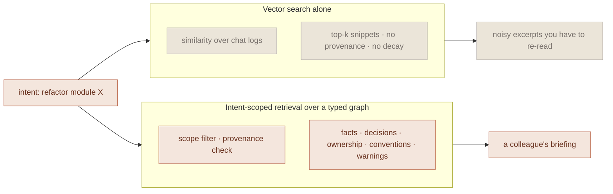

The default story for &quot;agent memory&quot; today is some version of: the model sees the recent conversation, plus maybe a vector store of older messages it can pull from on demand. That works for a while. It stops working at exactly the point you start needing memory to be useful. Which is when the agent crosses a boundary.

A new chat session. A different tool. A new project. A handoff between two agents. At every one of those boundaries, the implicit contract of &quot;memory = chat history&quot; breaks, and what you actually need is something more like a database.

## What chat history can&apos;t do

Concretely, four things:

1. **Cross-tool continuity.** Your editor agent decided last Tuesday that the team uses snake_case for new modules. Your CLI agent doesn&apos;t know that, because it&apos;s a different process with a different conversation log.
2. **Structured retrieval.** &quot;What does the agent know about authentication in this codebase?&quot; is a question chat history can&apos;t answer cleanly. It has to scan a wall of dialogue and hope the relevant context resurfaces.
3. **Trust differentiation.** A fact the user explicitly told the agent should outweigh a fact the agent inferred from a single file. Chat history flattens both into &quot;something that was said in a conversation.&quot;
4. **Decay.** A decision made six months ago about an API that&apos;s since been refactored is actively wrong. Chat history has no concept of stale.

Vector stores fronting chat history fix retrieval but inherit every other problem. The store is full of dialogue snippets with no contract about what they assert, no provenance, and no decay policy. It looks like memory; it&apos;s a search index over things that were said.

## What memory-as-infrastructure looks like

A different shape: treat memory as a typed, contracted, queryable surface that lives outside any one agent or session.

```mermaid
flowchart LR
  classDef accent fill:#f4e6dd,stroke:#b45a3c,color:#6A3320
  classDef plain fill:#f3efe7,stroke:#d4cdbe,color:#1c1917

  subgraph Tools["Agents (any tool)"]
    direction TB
    T1[editor agent]:::plain
    T2[CLI agent]:::plain
    T3[CI agent]:::plain
    T4[review bot]:::plain
  end

  subgraph Contract["Contract layer"]
    direction TB
    C1[typed write<br/>kind + scope + provenance]:::accent
    C2[validation +<br/>decay policy]:::accent
  end

  subgraph Memory["Memory graph"]
    direction TB
    M1["facts<br/>(what is true)"]:::plain
    M2["decisions<br/>(what was chosen)"]:::plain
    M3["ownership<br/>(who owns what)"]:::plain
    M4["conventions<br/>(how things are done)"]:::plain
  end

  subgraph Retrieval["Intent-scoped retrieval"]
    R1["query: 'what should I know<br/>to refactor module X?'"]:::accent
  end

  Tools --> C1 --> C2 --> Memory
  Memory --> R1 --> Tools
```



Four pieces, each doing real work:

**Typed writes.** When an agent records something, it has to declare what kind of thing it is. A fact, a decision, a convention, an ownership edge. Along with the scope it applies to (project, module, file) and where it came from (which agent, which tool, which commit). This is the part that makes memory queryable months later. An untyped write is a junk-drawer entry; a typed write is a row.

**Provenance on every write.** Every entry carries a small bundle: which agent wrote it, in which tool, at which commit, prompted by which user action. This is what lets you answer &quot;why does the agent think this?&quot; six weeks later when something is wrong. Without it, you have a model that&apos;s confidently citing things it can&apos;t defend.

**Intent-scoped retrieval.** Reads aren&apos;t &quot;here&apos;s a query embedding, give me the top 10 nearest neighbors.&quot; Reads are &quot;the agent is about to refactor module X. What facts, decisions, conventions, and ownership edges scope to that module?&quot; Vector similarity is one input. The graph structure of the memory does most of the work.

**Decay policy.** Beliefs go stale. Without explicit decay, memory becomes a fossil record of every wrong guess the agent ever made. Per-fact decay timestamps let retrieval favor recent, reinforced knowledge. And let memory honestly say &quot;I used to think X, but I last wrote that 90 days ago and nothing has reinforced it since.&quot;

## The contract is the part that matters

Of those four pieces, the contract layer is the one that earns its keep over time and the one most projects skip because it&apos;s tedious.

A contract on writes does three things: it forces the agent to be specific about what it&apos;s claiming (which improves the writes), it makes the memory legible to humans who weren&apos;t in the conversation that produced it (which is what makes it useful), and it gives you a rejection point for low-quality writes (which is what stops the store from filling up with garbage).

Without it, you get a memory that grows without limit, contradicts itself, and can&apos;t be queried except by similarity search. Eventually you stop trusting it, and at that point you may as well not have it.

## What &quot;query memory&quot; should mean

Not this:

```
search("authentication module") → top 10 chunks of past conversations
```

This:

```
context_for(intent="refactor module auth/", agent="cli-001") →
  facts:        ["bcrypt rounds raised to 12 on 2024-03-04",
                 "session tokens are 32-byte random, base64-urlencoded"]
  decisions:    ["picked argon2 over scrypt for new hashes (ADR-014)"]
  ownership:    ["module owned by @sagar, on-call @priya"]
  conventions:  ["module-private functions prefixed with _"]
  warnings:     ["last refactor here in May 2024 broke prod;
                  see incident-2024-05-08"]
```

The first is a search. The second is what an experienced colleague would tell you in two minutes if you asked. That&apos;s the gap the infrastructure has to close.



## Why this matters now

Every agent product I&apos;ve looked at has, at some level, recognized that the chat-history-as-memory model isn&apos;t quite working. The responses are usually one of: longer context windows, better RAG over conversation logs, or a side-channel notes file the agent maintains.

All three are workarounds for the underlying issue, which is that &quot;a wall of past dialogue&quot; isn&apos;t the right primitive. The right primitive is closer to a typed graph with provenance, decay, and intent-scoped retrieval. That&apos;s a database. It belongs outside any one agent, behind a contract that&apos;s the same regardless of which tool is reading from or writing to it.

## What I&apos;m building toward

This is the thesis behind one of my current product explorations for AI-assisted engineering teams: make shared context and verification visible enough that humans can rely on the workflow. The companion post on [why enforcement has to be in the request path](/writing/mcp-proxy-as-enforcement-primitive) covers the broader idea without tying it to product internals.

Email me if you&apos;re working on something adjacent. I&apos;d like to compare notes. Especially with anyone running multi-tool agentic coding workflows in earnest.
