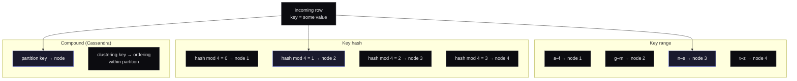
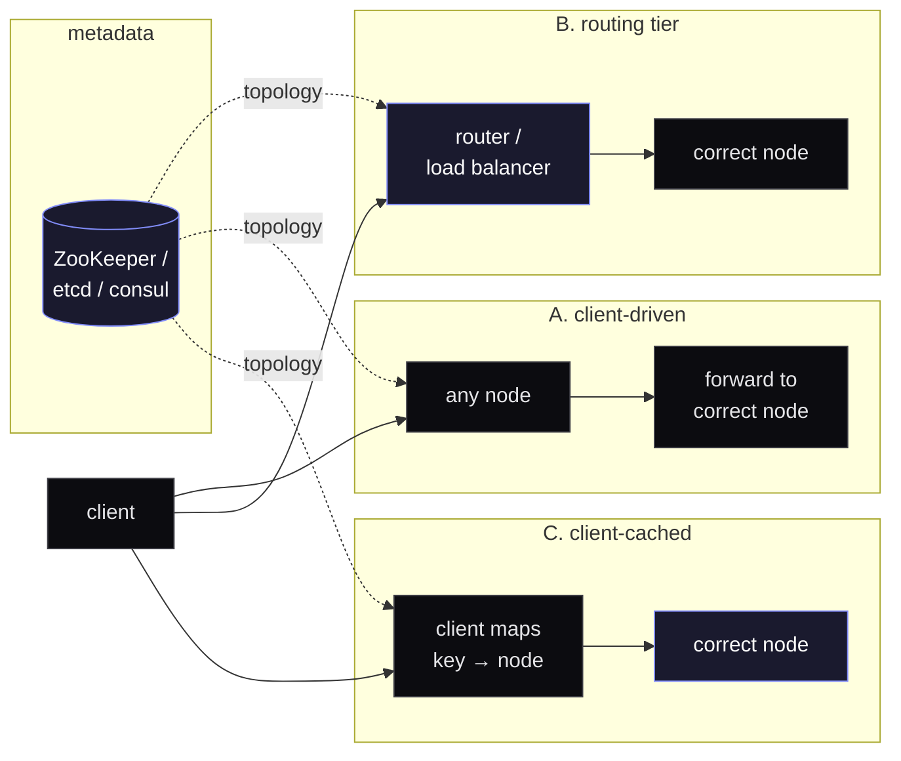

The reason partitioning gets confusing is that &quot;partitioning&quot; covers four distinct decisions that are usually discussed as one. They&apos;re related, but you can pick them somewhat independently, and the right answer to each depends on the read pattern of the system you&apos;re building, not on the database you happened to start with.

The four decisions:

1. **How do you assign rows to partitions**. By key range, by key hash, by something else?
2. **How do you handle secondary indexes** when the primary partitioning is by some other column?
3. **How do you rebalance** when nodes come and go or hot spots emerge?
4. **How does the client find the right partition** for a given key?

I&apos;ll go through each one with the trade-off that actually bites in production, then close with a real case study.

## Decision 1: how to assign rows to partitions

The two common choices and the third one nobody talks about:

**Key range** keeps physically-adjacent keys on the same node. Range scans are fast (`WHERE created_at BETWEEN ...` doesn&apos;t leave the partition). The cost is hot spots. If you partition by timestamp, today&apos;s node takes all the writes. If you partition by user ID and your top user has 10× the activity of the median, that node burns.

**Key hash** spreads writes evenly by hashing the key first. No hot spots from skewed keys. The cost is that range queries on the partitioning key now have to scatter across every node and gather the result, which is exactly as expensive as it sounds.

**Compound keys** (Cassandra calls them this; DynamoDB calls them &quot;partition + sort key&quot;) split the difference. The first part of the key picks the node; the rest orders rows within that partition. You get range scans within a partition while still distributing the workload across the cluster. Most workloads I&apos;ve seen are better served by this than by either of the previous two.

The right default for a new system is usually compound: hash on something high-cardinality and stable (`user_id`, `tenant_id`), order on something queryable within that scope (`created_at`, `event_id`).

## Decision 2: secondary indexes

The moment you need to look up rows by something other than the partition key, you have a problem. Two strategies, both with real costs:

**Local index (scatter-gather).** Each partition keeps its own index over its own rows. Reads by the indexed column have to fan out to every partition and merge the results. This is the default in Cassandra and most NoSQL stores; it&apos;s cheap to write and expensive to read.

**Global index.** A separate, partitioned index over the indexed column, distributed by the indexed column&apos;s hash. Reads are fast (one network hop). Writes are expensive. Every insert into the base table has to also write to the index, possibly on a different node, and now you have a two-phase write to reason about.

The trade-off matters because most people pick local indexes by accident (they&apos;re the default) and then wonder why a particular query pattern is slow. If a secondary lookup is on a hot path, you almost certainly want a global index. Or, more often, you want to denormalize and stop calling it an index at all.

## Decision 3: rebalancing

Eventually a node fills up, a node dies, or you add capacity and want the cluster to use it. Two schemes:

**Fixed partitions.** Pre-create more partitions than you have nodes. Say, 1024 partitions across 4 nodes. When a fifth node joins, it takes 256 partitions over from the existing four. Data moves once per topology change and predictably. The downside is you have to size the partition count up front; too few and you can&apos;t scale, too many and metadata overhead bites.

**Dynamic partitioning.** Partitions split when they grow past a threshold and merge when they shrink. You don&apos;t pre-size anything. The cost is that splits happen during writes, briefly hurting tail latency, and the topology is harder to reason about because it&apos;s always shifting.

I lean fixed for systems where the data shape is predictable (an analytics warehouse, a metrics store) and dynamic for systems where you genuinely don&apos;t know the distribution in advance (a multi-tenant SaaS in early growth).

## Decision 4: service discovery

The client has a key. It needs to know which node to talk to. Three approaches:

**Client-driven** is the simplest deployment. Any node can answer; if it isn&apos;t the right one, it forwards. The trade-off is one extra hop on the wrong-node case, and the assumption that nodes know about each other&apos;s topology (usually via gossip).

**Routing tier** puts a dedicated layer between client and storage. Clean separation, easy to scale the router independently. The cost is that the router now has to be highly available, and it adds a hop on every request.

**Client-cached** has the client maintain its own partition map, refreshed periodically. Fastest in the steady state. The cost is staleness. When topology changes, the client gets a few wrong-node responses before refreshing. Most production drivers (Cassandra, Mongo, Kafka) do this with a token-aware policy and a coordinator-fallback.

ZooKeeper, etcd, and consul keep showing up because someone has to be the source of truth on topology, and they&apos;re built for exactly that job.

## Case study: Discord&apos;s migration from Cassandra to ScyllaDB

Discord stores trillions of messages. They were on Cassandra and ran into two problems that scale exposes: tail latency on hot partitions (a single channel taking writes faster than Cassandra&apos;s compactor could keep up) and ongoing operational cost (constant compaction tuning, GC pressure, manual repairs after node failures).

They migrated to ScyllaDB, which is broadly Cassandra-compatible at the wire level but rewritten in C++ with a shard-per-core architecture and no JVM. They also built a Rust data service in front of it that coalesces requests. Many concurrent reads of the same hot key collapse into one storage read, then fan back out to the requesters.

The migration moved trillions of messages without downtime. The result they reported: lower tail latency, less operational toil, and the same data model. Worth reading: Discord&apos;s [own writeup](https://discord.com/blog/how-discord-stores-trillions-of-messages) is unusually candid about what didn&apos;t work the first time.

The lesson I take from it: the database choice matters less than the &quot;extra layer in front of it&quot; choice. Coalescing requests, batching writes, picking a tighter partition key. Those are decisions you make at the application layer, and they&apos;re what determine whether your storage layer survives the next 10× in load.

## A short closing opinion

Most teams I&apos;ve seen pick a partition key based on what&apos;s convenient at insert time and then live with the consequences for years. The half hour you spend at the start mapping read patterns to partitioning strategy is some of the highest-leverage thinking you&apos;ll do on the system. If you can only afford to do one of the four decisions deliberately, do that one.
