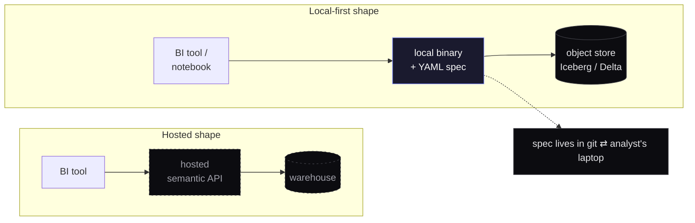
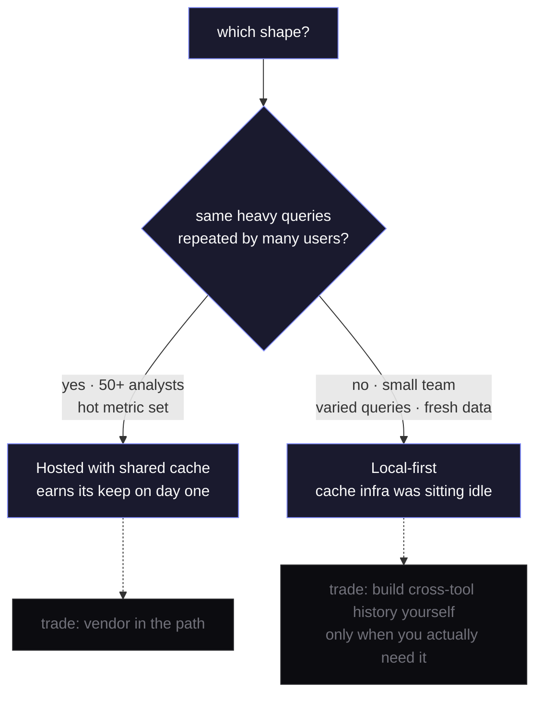

The default shape of a &quot;semantic layer&quot; in 2024 is a hosted service that sits between your warehouse and your BI tool. You point it at Snowflake or BigQuery, define metrics and dimensions in YAML, wire SSO, and pay per query.

This is the right shape for some companies. It is the wrong shape for more companies than the vendors selling it would prefer to admit.

## What a hosted semantic layer actually buys you

Three things, broadly:

1. **A consistent metric definition** across everyone in the org who queries the same data. &quot;weekly active users&quot; means the same SQL whether the question came from Looker, Superset, or a Slackbot.
2. **An access-control surface** that&apos;s separate from the warehouse. Analysts can query metrics without having `SELECT *` rights on the underlying tables.
3. **A caching layer** that fronts the warehouse and amortizes expensive aggregates.

That&apos;s real value. None of it is free, and almost none of it requires the layer to be hosted somewhere other than the analyst&apos;s machine.

## What it costs

Pricing models vary, but the operational shape is consistent. You&apos;re adding:

- A vendor relationship and a procurement process to start using it
- An SSO integration to maintain
- A control plane that sits in the request path on every query
- A tail-latency tax. Usually 50–250ms per query, on top of the warehouse round-trip
- A bill that grows with usage

For a 50-person company querying their own data warehouse, this is fine. For a 5-person team that genuinely just needs metric consistency between three notebooks and a dashboard, it&apos;s a sledgehammer. The team adopts it because the alternative looks like &quot;everyone writes their own SQL and hopes it agrees with everyone else&apos;s,&quot; and that alternative is correctly identified as bad.

The mistake is assuming those are the only two options.

## A third shape: local-first

The semantic layer doesn&apos;t have to be a service. It can be a binary, plus a YAML spec, plus a git repo. It compiles on the analyst&apos;s laptop, runs against open table formats in their object store, and writes its results back to the same place.

The spec lives in git. The binary is a single executable. The data lives in Iceberg or Delta tables in S3 / GCS / R2. Queries run in-process via DuckDB or DataFusion. The analyst gets metric consistency, the team gets a PR review process for metric changes, and there&apos;s nothing in the request path that needs a credit card.

## The trade-off everyone gets wrong

People assume the trade-off is &quot;hosted = scale, local = small.&quot; That&apos;s not where the actual seam is.

The seam is **whether you have a centralized cache that everyone hits**. If your team has a hundred analysts running the same heavy aggregate every morning, a hosted layer with a shared cache earns its keep on day one. If your team is five people running slightly different aggregates against largely fresh data, the cache wasn&apos;t doing much for you and now you&apos;re paying for a cache.

DuckDB on a laptop will happily push a multi-billion-row aggregate over Iceberg in seconds. The constraint isn&apos;t compute. The constraint is &quot;does the same expensive query happen across enough users to make centralized caching valuable.&quot;

For a lot of companies. Especially the ones running an analytics function with under twenty people. The answer is no.

## What you give up

Honest list:

- **Cross-tool query history.** A hosted layer logs every query centrally, which is useful for audit and for &quot;who else has asked this question recently?&quot; You can build this on top of a local-first system, but it doesn&apos;t come for free.
- **Live access control.** With a centralized service you can revoke a user&apos;s access in one place, instantly. With a local-first system, access is enforced at the object-store level (which is the right place for it, but the workflow is different).
- **The convenience of a SaaS dashboard for your spec.** You manage the spec in a repo. PR review is the UI.
- **A single throat to choke when something is slow.** When the layer is your team&apos;s laptops, &quot;why is this query slow?&quot; is your problem.

For my money, the second and third trade-offs are features. Object-store-level access control is what your security team would have asked you to build anyway. PR review on metric definitions is the right discipline regardless of where the layer runs.

## When local-first is actually wrong

I&apos;m not arguing it always wins. The cases where I&apos;d unambiguously pick a hosted layer:

- You&apos;re north of about 50 analysts and the same 20 metrics get pulled hundreds of times a day. Centralized caching is real money.
- You have a regulatory requirement for centralized query audit that&apos;s easier to satisfy with a managed service than to build.
- Your team genuinely doesn&apos;t want to think about infrastructure, even one binary&apos;s worth, and your BI vendor has a serviceable layer baked in.

Outside those, the math is closer than the marketing makes it look.

## The version of this I&apos;m building

A product in this category should make the semantic layer feel close to the user, keep review workflows visible, and avoid turning AI into an opaque control plane. The specific implementation details are less important than the discipline: keep the workflow inspectable and make trust a product behavior, not a marketing claim.

If you&apos;re running a 5–20 person analytics function and the modern data stack feels like more weight than your team&apos;s problem deserves, the local-first cut is worth a serious look. The vendors won&apos;t tell you that. They&apos;re not wrong; they&apos;re just selling the hosted shape, and the hosted shape is wrong for more teams than they&apos;d like.
