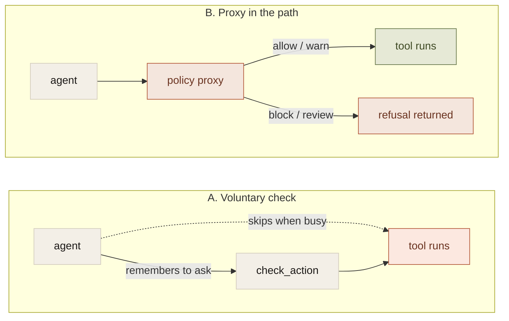
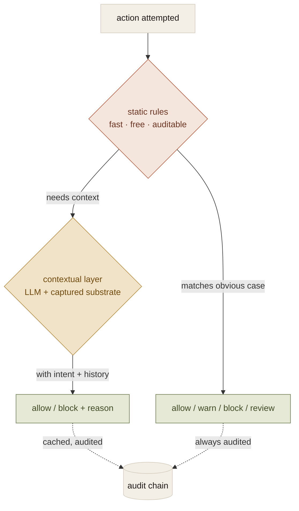

When you wire a policy layer into an MCP-using agent stack, there are roughly two paths.

The first looks elegant. You expose a tool the agent calls voluntarily before doing anything destructive. &ldquo;please check this command before running it.&rdquo; The check returns allow, warn, review, or block. The agent does the right thing.

The second path looks heavier. A process sits between the agent and the tools it uses. Every action the agent attempts flows through. The proxy evaluates the same policy and decides whether to forward, forward with a note, or return a refusal the agent has to react to.

The first path is the only one that fails. The second is the only one that works.

## Why voluntary fails

Three failure modes that show up almost immediately.

The agent forgets. Not every time. Most of the time the check fires and everything is fine. But the variance over thousands of tool calls is non-zero, and the one call it forgets is the one with a destructive command in the argument. The base rate doesn&apos;t matter once you&apos;re past a meaningful number of operations; the tail does.

There&apos;s a window between the check and the action. An agent that asks the policy layer for permission and then makes the destructive call has time between the two in which conditions can change. A different file gets staged, a context flips, a branch updates. The check passes against state A; the action fires against state B.

The trust boundary is in the wrong place. A safety check that depends on the thing being checked to call it is not a safety check. It&apos;s a request for a status update. If your safety primitive is advisory, you&apos;re not enforcing anything; you&apos;re documenting intent.

## The shape that works

Put the policy layer in the request path. The agent doesn&apos;t know it&apos;s there. Every action the agent attempts is intercepted, evaluated, and either forwarded to the downstream tool or returned to the agent as a refusal it has to handle. Destructive operations stop being advisory because there is no path through the system that bypasses the check.

The agent gets a structured refusal it can react to. Apologize, try a different tool, escalate to the human. There&apos;s no window in which the destructive thing happens because the policy was optional.

## Capture as a byproduct

The non-obvious consequence: once the policy layer is in the path, you also have a capture point.

Every action becomes a record. What was attempted, what the policy said, what actually happened. That&apos;s the team&apos;s shared context, accumulated automatically as work proceeds. No separate instrumentation pipeline. No agent that has to remember to call a logging tool.

This is why building enforcement and capture as separate things is a mistake. They&apos;re the same observation. If you&apos;ve put the layer in the path, you&apos;ve built both.

## Static rules plus contextual judgement

Static rules cover the obvious destructive cases. Clearly destructive shell commands, schema changes, force pushes, writes to credential files. They fall apart on the cases that need context. A write to a production system that&apos;s legitimate during a planned migration and illegitimate the rest of the time. A force push that&apos;s correct when the operator said &ldquo;rewrite my last three commits&rdquo; and wrong otherwise.

The right shape is two layers in sequence. Static rules fire first. Fast, free, deterministic, auditable. Most decisions never need anything more. For the cases that genuinely require contextual judgement, the policy layer can defer to a model with the captured context. The deterministic layer is the floor; the contextual layer is the exception. Most teams skip this and try to use one or the other for everything; both directions end badly.

## What this generalizes to

The pattern reaches beyond agents. Any system where a process makes decisions you&apos;ll need to reason about later benefits from the same shape. Capture in the request path, enforce there, audit there. Voluntary instrumentation is a documentation artifact. Load-bearing instrumentation is a control.

For agent stacks specifically: if your policy layer&apos;s primary surface is &ldquo;a tool the agent calls when it remembers to,&rdquo; you&apos;re not done yet. The proxy in the path is the enforcement primitive. The capture layer falls out of having put it there.

That&apos;s been the most surprising lesson for me. I came in thinking the harder problem was the substrate. What to capture, how to type it, how to retrieve it. It is hard. But the substrate is downstream. The enforcement primitive is what makes everything built on top of it real.
