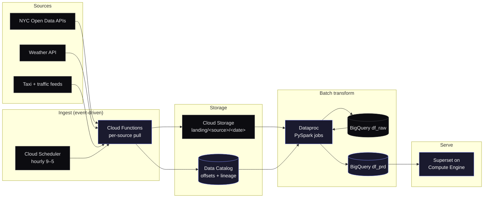
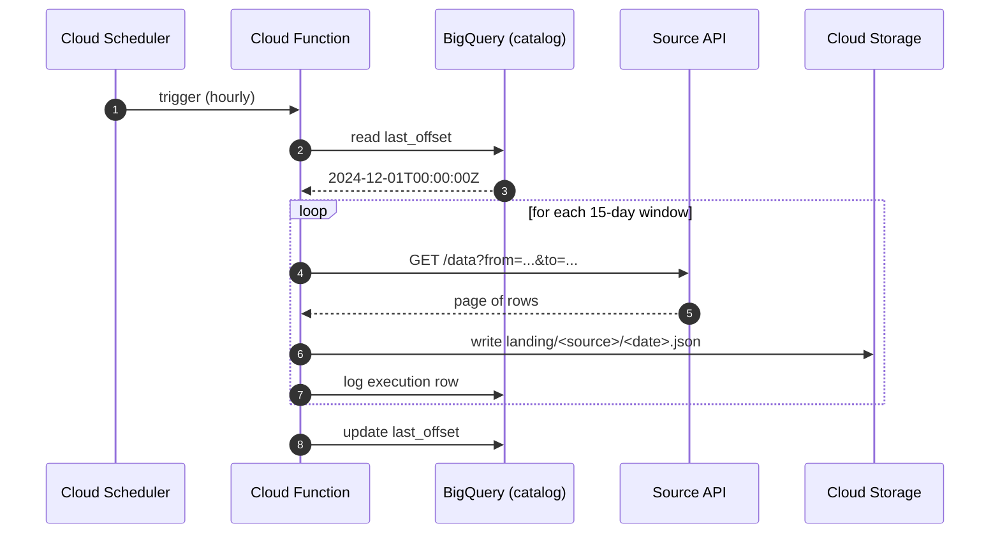

This started as a graduate project at UMD and grew into a small reference architecture for a question I find genuinely interesting: how much of New York&apos;s road safety story can you actually pull out of public data, and what does it cost to build the pipeline?

The short answer: a surprising amount, and less than you&apos;d think. Provided you&apos;re willing to throw out the parts of the modern data stack you don&apos;t need.

## What we were trying to answer

Five questions, all observable from public data:

- Does weather actually correlate with crash severity, and if so, by how much?
- Are taxi-heavy boroughs over-represented in serious crashes?
- Have year-on-year fatalities trended up or down once you control for traffic volume?
- Which turning maneuvers and speed bands carry the worst outcomes?
- Are particular vehicle-registration states over-represented in high-impact incidents?

Each question becomes a different join, but they all want the same shape underneath: a long-form fact table of crashes, joined to context tables (weather windows, traffic counts, taxi trip density) at the right grain.

## The architecture, end to end

Six GCP services, glued together by shell scripts and `crontab` rather than a workflow orchestrator. That&apos;s the controversial choice; I&apos;ll defend it below.

Three things to call out from that picture.

**Cloud Functions, not Dataflow, for ingest.** The data we needed was REST-fetched in 15-day windows. That&apos;s a script with offset tracking, not a streaming pipeline. A Cloud Function with a Cloud Scheduler cron is roughly fifty lines of code and zero infrastructure to manage. Dataflow would have been the &quot;right&quot; tool by a textbook reading and the wrong tool by every practical measure.

**Dataproc, not Composer.** Composer (managed Airflow) is great when you have ten teams sharing dependencies and a real ops budget. We had four people and a deadline. A bash script that spins up a Dataproc cluster, runs a PySpark job, and tears the cluster down again costs nothing when nothing is running and reads about as well as a DAG would. The trade-off is that you don&apos;t get a UI, and that&apos;s fine. `crontab -l` is the UI.

**Compute Engine as the orchestrator.** We put Superset and the cron jobs on the same VM. That&apos;s heretical from a microservices angle and obvious from a cost angle (we paid for one tiny machine and got both a dashboard host and an orchestrator out of it).

## The non-obvious gotcha: batching to avoid OOM

The first ingest function we wrote pulled the full traffic dataset in one go, ran out of memory, and died politely. The fix was a windowing layer that splits the fetch into 15-day chunks and writes each chunk to GCS independently before the next one starts:

Two effects from this. First, the function never holds more than one window in memory, so we can run it on the smallest function size. Second, when something fails halfway through (and it does, because public APIs flake), the next run resumes from the last successful window without double-counting.

The execution log in BigQuery (`df_catalog`) is doing more work than it looks like in the diagram. Every run writes a row with status, duration, row count, and any error message. When ingest goes sideways at 2 a.m., that log is the only thing standing between you and a cold-start debugging session.

## Storage layout

Two physical tiers, each chosen for what it&apos;s actually good at.

**Cloud Storage with schema-on-read.** Raw and intermediate files live in GCS partitioned by `landing/<source>/<yyyy-mm-dd>/`. The schema is whatever the API returned. This is cheap, durable, and Spark-friendly. Schema-on-read is the right discipline at this layer because the upstream APIs do change shapes occasionally and we&apos;d rather find out at the transform stage than at ingest time.

**BigQuery with schema-on-write.** The analytical layer is three datasets:

| Dataset      | What lives there                                   | Schema  |
| ------------ | -------------------------------------------------- | ------- |
| `df_raw`     | One-to-one with GCS landings, casts applied        | Strict  |
| `df_prd`     | Joined, de-duped, partitioned by year/month        | Strict  |
| `df_catalog` | Run logs, ingestion offsets, lineage events        | Strict  |

Partitioning `df_prd` by year/month is the single biggest cost lever in the project. Most of our queries hit a 6–12 month window; partition pruning means we&apos;re not scanning a decade of data to answer a quarterly question.

## Why PySpark over Apache Beam

Beam is the obvious GCP-native answer, and we benchmarked it. Two reasons we went the other way:

1. **The workload is batch.** Beam&apos;s strength is the unified batch + streaming model. We had no streaming requirement, and Spark&apos;s batch primitives are more mature in practice. Particularly the BigQuery and Iceberg connectors.
2. **JSON munging at scale.** Most of our raw data was JSON-shaped, and PySpark&apos;s `from_json` + struct manipulation was honestly more pleasant than the equivalent in Beam Python. Subjective, but it added up across the surface area.

If we&apos;d had a streaming source we&apos;d have reconsidered. We didn&apos;t.

## Dashboards: Superset over Looker

We needed something we could deploy on the same VM as the orchestrator, that talked to BigQuery natively, and that didn&apos;t require us to file a procurement ticket. Superset hit all three. Looker would have been better polish; Superset was good enough and let us keep moving.

The interesting visualizations turned out to be the network graph (how vehicle types co-occur in serious crashes) and the donut overlay of weather conditions against severity bands. Both shipped insights we wouldn&apos;t have surfaced from a dashboard built around bar charts.

## What I&apos;d do differently in v2

A short list, because every project earns one of these:

- **Land in Iceberg, not raw GCS files.** Schema-on-read served us, but Iceberg gives us schema evolution + time travel + partition pruning at the lake layer. Spark works with both; the cost of Iceberg is one extra dependency, and we&apos;d earn it back the first time we needed to roll back a bad ingestion.
- **Replace `crontab` with Dagster.** Not Composer (still too heavy), but a lightweight orchestrator that gives us asset-aware lineage and a UI that&apos;s actually pleasant. The shell scripts worked; they&apos;d also be the first thing to fall over with a fifth pipeline.
- **Move the dashboards to Lightdash.** Superset&apos;s metric layer is fine for ad-hoc; once you have a real semantic spec, Lightdash treats your dbt project as the source of truth and the dashboards stop drifting from it.

## The repo

Everything is open: [github.com/sagar8080/data-fusion-engineering](https://github.com/sagar8080/data-fusion-engineering). The Terraform module at the root will stand up the whole stack on a new GCP project in about ten minutes. Costs roughly $40/month at the cadence we ran it, most of which is the VM.

The thesis I&apos;d underline from doing the project: most data-engineering decisions are about saying no to tools you&apos;re &quot;supposed&quot; to use. The modern data stack is large; the right cut for any given project is small. The hardest part is getting comfortable with that.
