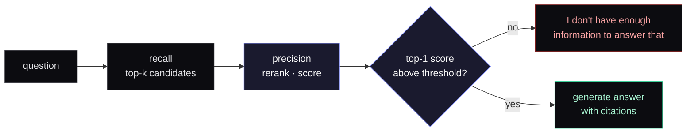
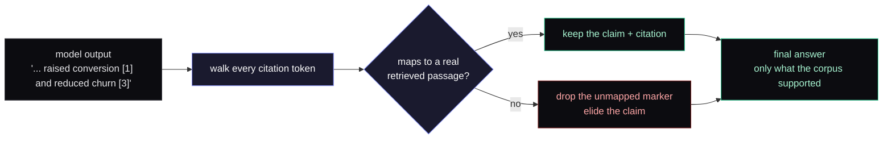

There&apos;s a recurring pattern in RAG products where the response to &ldquo;the model invented an answer because the corpus didn&apos;t actually have one&rdquo; is to make the prompt nicer. Add &ldquo;only answer if you&apos;re sure.&rdquo; Add &ldquo;cite your sources.&rdquo; Add a worked example of an honest refusal. Switch models. Re-tune the temperature.

This is a losing game. The model is doing exactly what it was trained to do, which is produce fluent text continuations. The fluent continuation in the absence of relevant context is a confidently-wrong answer. You can soften the slope by being polite to it, but you can&apos;t change the destination.

The winning move is to handle refusal in the orchestration layer.

## The shape

Before any answer is generated, the retrieval pipeline produces a confidence signal. How well the top result actually matches the question. If that signal falls below a calibrated threshold, the orchestration layer returns the literal sentence &ldquo;I don&apos;t have enough information to answer that&rdquo; instead of running an answer step at all. No fluent continuation gets a chance to invent something.

This is the primary defense against confidently-wrong answers on out-of-corpus questions. Everything else. Better prompting, better models, better retrieval. Moves the failure rate around the edges. The threshold gate sets the ceiling on it.

## Why the gate goes after the precision step, not the recall step

A natural impulse is to gate on the initial retrieval. If the recall step returns nothing relevant, refuse. Two reasons that&apos;s the wrong place.

The recall step optimizes for recall. It returns top-k candidates including a long tail of semi-relevant matches that look reasonable to a similarity score and read as completely off-topic to a human. A recall-stage threshold either fires constantly (recall is doing its job) or you turn it down so far it stops gating anything.

The precision step optimizes for precision. It produces a calibrated signal about &ldquo;is the top result actually relevant?&rdquo;. Which is the only signal in the pipeline that&apos;s aligned with the question the gate is actually asking. So the threshold goes after the precision step. The cost of running it on a query that will refuse is real but small. The cost of skipping it is fluent hallucination on the cases the corpus doesn&apos;t support. That&apos;s the exact failure mode the gate exists to prevent.

## The companion: don&apos;t trust the model to invent citations

The threshold gate handles &ldquo;the corpus has nothing.&rdquo; The other failure mode is &ldquo;the corpus has something, but the model invented additional citations to make the answer feel more authoritative.&rdquo; Different problem, same family.

The fix is parallel. The model is required to mark every claim with a citation token that points to a specific retrieved passage. After the answer comes back, a deterministic step walks every citation token and verifies it maps to a real retrieved passage. Anything that doesn&apos;t map is dropped from the answer.

We don&apos;t trust the model to invent citations. The orchestration layer is the source of truth on what was actually grounded.

This sounds like a small detail. It&apos;s the difference between a confident-looking answer with a fabricated reference next to a sentence the corpus doesn&apos;t actually support, and an answer that simply elides that sentence. The first is worse than refusing. The second is what users can build trust on.

## What this trades off

Three things, honestly.

Some legitimate questions get refused because the corpus does support them but the precision signal doesn&apos;t cross the threshold. The fix is corpus engineering. Better chunking, better question expansion. Not lowering the threshold. The threshold is the dial you keep your hands off of.

A refused query still pays the cost of the retrieval pipeline. That feels worse than a snappy &ldquo;I don&apos;t know&rdquo; that doesn&apos;t check anything. We accept it because the alternative is an answer step (more cost, plus the hallucination risk).

Users have been trained to expect an answer to every question. A product that refuses occasionally feels worse on the first day and better on the tenth, because every answer that does come back is one users can trust. Optimize for day ten.

## The general lesson

When you&apos;re combining a probabilistic component with a deterministic orchestration layer, put the safety primitive in the orchestration layer. Don&apos;t try to make the probabilistic component safe by talking to it nicely. The probabilistic component is doing what it&apos;s built for; the orchestration layer is where you get to decide what gets returned.

This is the same shape as putting [enforcement in the request path](/writing/mcp-proxy-as-enforcement-primitive) rather than in a tool the agent voluntarily calls. The model gets to do its job. The orchestration layer gets to say &ldquo;yes, this is fine&rdquo; or &ldquo;no, this is not.&rdquo;

For RAG specifically: a refusal threshold and a citation post-processor are the two cheapest, most effective defenses against the failure mode that breaks user trust. They&apos;re less interesting than model selection or embedding choice, which is exactly why teams skip them. They&apos;re also what separates a product users come back to from a demo that won&apos;t survive its first month with skeptical reviewers.
