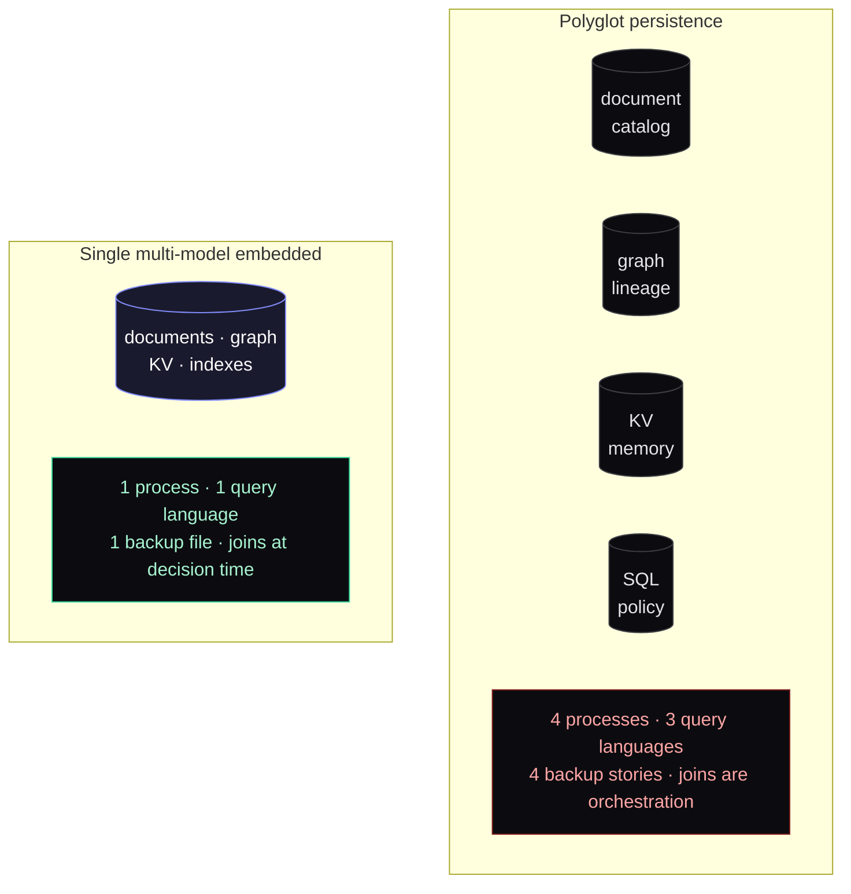
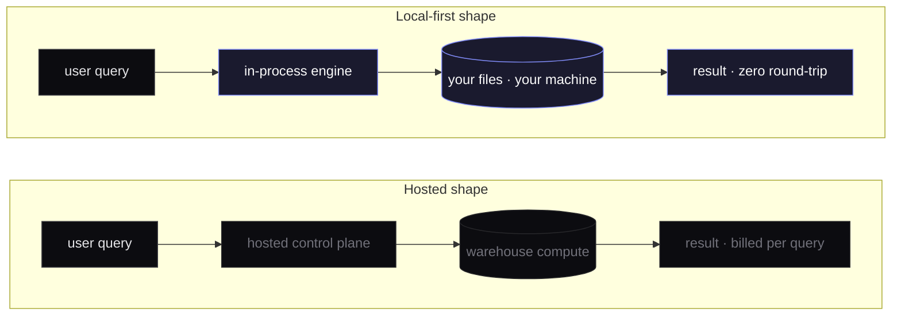

Most data tools today are services. You point them at your warehouse, you sign in, and your queries make a round trip to someone else&apos;s control plane before they reach your own data. For a lot of work. Large teams, shared dashboards, centralized governance. That&apos;s the right shape.

It&apos;s also wrong for more situations than the industry admits. Single operators. Small analytics teams. Products that need to go where sensitive data already lives instead of asking the data to come to them. For those cases the right shape is a single application the user can run on their own machine, against their own files, with nothing in the request path that needs a credit card.

Two storage decisions sit at the heart of building one of those applications, and they look more independent than they are.

## The metadata problem

The first decision is what holds everything that isn&apos;t the data itself.

A working catalog is document-shaped. Schemas, columns, types, descriptions, contracts. Lineage is graph-shaped. Datasets connected to transforms connected to outputs, with edges carrying their own metadata. Workspace memory is key-value-shaped. Approved facts, prior queries, user-tagged notes. Policy is document-shaped with cross-references. Audit is append-only.

The textbook answer is one store per shape. Document database for the catalog, graph database for lineage, key-value store for memory, another database for policy. Four processes to deploy, four backup stories, three query languages, and an operational footprint that defeats the entire premise of shipping as a single application.

The honest answer for a local-first product is one embedded multi-model store that handles all four shapes. The trade is real. Multi-model embedded stores have younger ecosystems, fewer drivers, occasional sharp edges. The benefit is one process to deploy, one backup file, one query language across the surfaces that have to be joined at decision time. For a desktop application the user owns the lifecycle of, that simplification is the whole game.

## The compute problem

The second decision is where queries actually run.

The textbook answer for an analytics product is &ldquo;point at a hosted warehouse.&rdquo; You get scale, you get the warehouse vendor&apos;s ecosystem, you get someone else operating the compute. You also get a per-query round trip to a hosted control plane and a runtime cost that doesn&apos;t go to zero when nobody is using the product.

For a local-first product the answer flips. An in-process columnar engine over open file formats. Parquet, the open table formats, CSV when you have to. Gives you multi-gigabyte analytics on a laptop in seconds, with no external compute to provision and no warehouse round trip for the prototype queries that make up most actual analytical work. The trade-off is no auto-scale to petabyte ranges, which sounds bad until you remember that a desktop analytics tool isn&apos;t the right shape for a petabyte workload anyway.

## What you give up

Honest list. A hosted shape gives you a centralized cache that everyone hits, a managed query history, automatic credential rotation, and a vendor relationship that&apos;s also someone to call when things break. You give all of that up.

Whether the trade is worth it comes down to one question. Are the same expensive queries being made by enough users that a centralized cache earns its keep? For a 50-analyst team running the same 20 metrics hundreds of times a day, the answer is yes. For a 5-person team running mostly different queries against largely fresh data, the answer is no. And you were paying for cache infrastructure that wasn&apos;t doing anything for you.

The boundary is closer to the middle than the marketing suggests. Plenty of analytics teams that today run a hosted semantic layer plus a hosted warehouse plus a hosted BI tool would have shipped a year sooner with one binary on their analyst&apos;s machine.

## What it looks like when the two seams work together

A multi-model metadata store sitting next to an in-process query engine, both inside one process the user runs, talking to data that lives in formats anyone can read in storage the user controls. The metadata layer answers all the questions the AI surface needs to ask. The query engine handles the actual work against the actual data. The boundary between &ldquo;what the AI knows about the data&rdquo; and &ldquo;what runs against the data&rdquo; is the boundary between the two storage decisions.

Once you have both, a lot of architectural debates resolve themselves. You don&apos;t need to choose between &ldquo;the AI sees raw data&rdquo; and &ldquo;the AI is useless&rdquo;. The AI works with the metadata store; the query engine handles the bytes; they&apos;re different processes inside the same binary. You don&apos;t need to choose between &ldquo;hosted service with auth and SSO and SLAs&rdquo; and &ldquo;CSV files and Python notebooks&rdquo;. There&apos;s a third option, and it&apos;s where a lot of work that doesn&apos;t need either should live.

## What I&apos;d still revisit

The honest list of open questions for anyone trying this:

When the multi-model embedded store you picked matures its replication story, multi-workspace use cases become much easier. Until then they&apos;re a notable gap.

When in-process columnar engines stabilize their writers for the open table formats you care about, parts of the dual-engine setup might collapse to single-engine. That&apos;s a complexity reduction worth waiting for.

If a serious local graph engine emerges that&apos;s lighter than what currently dominates the multi-model space, it&apos;s worth re-running the comparison. The right answer for a 2026 local-first product is not necessarily the right answer for a 2027 one.

Good architecture is a live document. The shape works. The specific picks under it should be stress-tested every six months against the question &ldquo;is this still the right cut?&rdquo; If the answer turns no, that&apos;s the next post.
