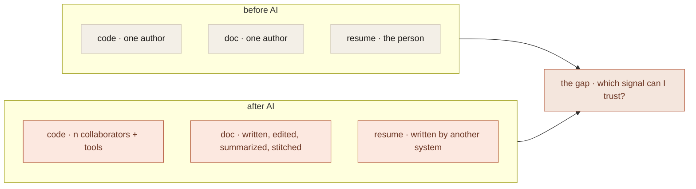
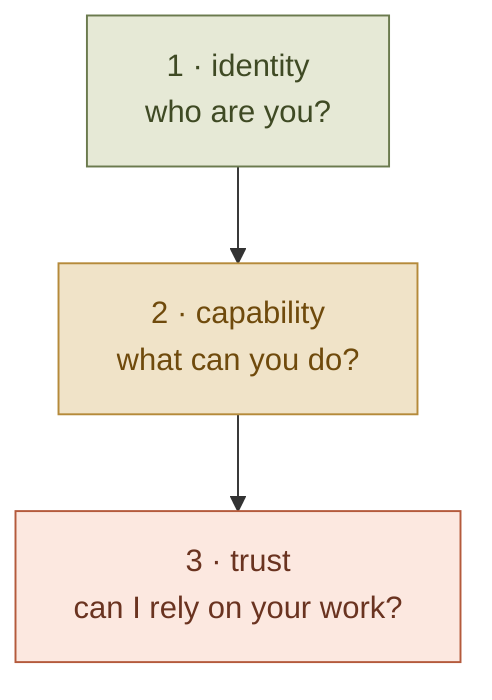

I think trust is the problem of the next decade.

Not AI. Not agents. Not models. Trust.

Because intelligence is rapidly becoming abundant, and trust is becoming scarce.

Twenty years ago, information was scarce. Google won because it helped people find it. Today information is effectively infinite, and the question became: which information can I trust?

AI accelerates that question dramatically.

## Signal is already collapsing in three places

**Code.** Before AI, the answer to &ldquo;who wrote this?&rdquo; was a name. John on the platform team. Today the honest answer is some mixture of John, Claude, Copilot, Cursor, a contractor, three interns, and nobody quite remembers. Attribution is becoming a fog.

**Documents.** Before AI you could assume the author understood what they wrote. Today a document could be human-written, AI-generated, AI-edited, AI-summarized, AI-translated, or AI-stitched together from five other documents. Authorship as a guarantor of meaning is dissolving.

**Recruiting.** Resume inflation existed. Now AI writes the resume, the cover letter, the LinkedIn posts, the portfolio, and the take-home assignment. Every candidate looks amazing. The signal collapses entirely.

## What knowledge work used to lean on

Companies trusted credentials, resumes, references, and brand. All four are weakening.

A credential certifies attendance, not capability. A resume narrates whatever the writer (or their AI) wants narrated. References are increasingly LLM-summarized themselves. Brand still matters, but it concentrates power in fewer institutions and tells you less and less about the individual contribution underneath.

The question stops being &ldquo;is this person impressive?&rdquo; and becomes &ldquo;how do I know this person, system, or agent is reliable?&rdquo;

That&apos;s a different question. Nobody has a good answer for it yet.

## Provenance is more interesting than &ldquo;memory&rdquo;

This is the deeper idea underneath what I&apos;m building inside [Relay](/projects/relay). The shorthand for that work is usually &ldquo;agent memory,&rdquo; but memory is the smaller version. The actual idea is whether we can preserve provenance for AI-assisted work. Not just what happened, but:

- why it happened
- who (or what) decided it
- what evidence existed at decision time
- what alternatives were considered
- what changed afterward, and whether the original decision still holds

That&apos;s trust infrastructure. It looks unglamorous next to &ldquo;we generated 10x more code.&rdquo; It is also probably the thing the next decade ends up valuing most.

## Three layers, only one of which is mostly solved

**Identity.** Who are you? LinkedIn handles it imperfectly for people. OAuth and SSO handle it for systems. Mostly solved.

**Capability.** What can you do? Resumes try, portfolios try, benchmarks try. Most of the attempts are noisy and getting noisier.

**Trust.** Can I rely on your work? Mostly unsolved. This is the layer everything actually depends on, and it has the worst tooling.

## More intelligence can reduce trust

This is the part most AI-product roadmaps haven&apos;t internalized.

Imagine a future agent that writes code, legal documents, and financial models better than the best humans. The hard question isn&apos;t &ldquo;can it generate the output?&rdquo; That question is already being answered. The hard question is &ldquo;why should I trust the output?&rdquo;

Generation is being solved. Verification isn&apos;t. Every additional unit of intelligence makes the verification problem harder, not easier, because more plausible output means more output that has to be checked.

## The accidental commodity

A lot of AI startups are quietly competing in what&apos;s becoming a commodity layer. Better generation, better prompting, better workflows. The long-term value probably lives somewhere else: provenance, verification, auditability, reputation, trust networks.

The internet solved information discovery. AI is solving information generation. The next wave is about information trustworthiness — and more broadly, decision trustworthiness, which applies equally to people, teams, AI agents, software systems, and organizations.

## Trust can&apos;t be declared

You can&apos;t launch &ldquo;we are the trust platform.&rdquo; Trust emerges from repeated, verifiable interactions over time. That&apos;s why the durable trust signals on the internet look the way they do:

- credit scores
- GitHub contribution history
- Stack Overflow reputation
- package ecosystem maintainer histories
- academic citations

None of them measure claims. All of them measure accumulated evidence.

That&apos;s the distinction, and it&apos;s the one I find myself coming back to most often when building anything in the AI era. The interesting product surfaces are the ones that capture provenance as a side effect of the work actually happening — not the ones that ask users to assert it after the fact.

The generation problem is being solved. The verification problem is open. I&apos;d build on the open one.
