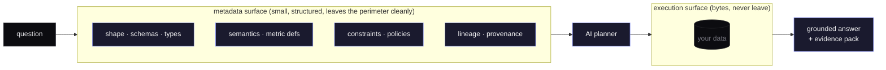
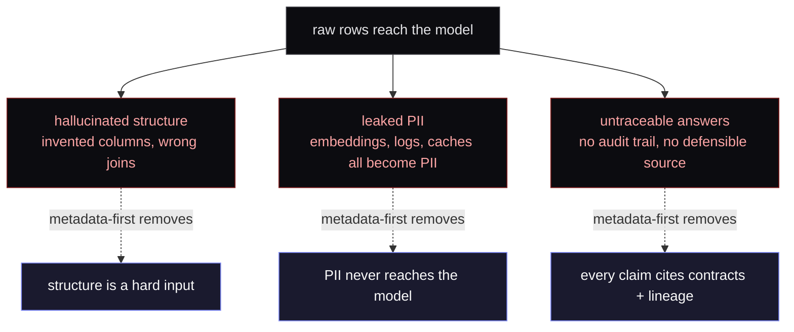

There is a quiet assumption in most AI-on-data products: that the model needs to see the data to be useful. Sometimes that's stated outright ("just give the LLM access to your warehouse"), more often it's implied by the architecture. A vector store fed by raw rows, an agent with a database connection string, an embedding pipeline running over PII columns "just in case."

The assumption is wrong, and it gets more wrong the more regulated the environment is.

## What the model actually needs

To answer a real analytics question. "what's our churn rate this week?". The model does not need to see customer rows. It needs to know:

- **The shape.** Which tables exist, what columns, what types, what relationships.
- **The semantics.** That `cancelled_at` defines churn, that "this week" is a calendar week aligned to Monday in this org, that the metric is `count(cancelled) / count(active)`.
- **The constraints.** Which columns are PII, which queries require approval, which time windows are allowed.
- **The lineage.** Where the data came from, when it was last refreshed, whether the upstream contract has changed.

All of that is *metadata*. It's structured. It's small. It can be retrieved, validated, and reasoned over with deterministic tools. It also doesn't leak when it leaves the perimeter. Because there's nothing in it to leak.

## What happens when you give the model raw rows

Three failure modes show up, in order of severity:

1. **Hallucinated structure.** The model invents a column, joins on a key that doesn't exist, or assumes a relationship that the schema doesn't support. Without metadata as a hard constraint, the LLM treats SQL as creative writing.
2. **Leaked PII.** Embeddings of raw rows are PII. Logs of LLM calls become PII. Caching layers become PII. Every surface that touches the bytes becomes part of the compliance perimeter, whether you intended it or not.
3. **Untraceable answers.** The model says "2.4%." Where did that come from? Which rows? Which definition? Without grounding in metadata, there's no audit trail you can defend to security, legal, or the analyst who reads it.

Metadata-first architecture avoids all three by construction. The model doesn't hallucinate structure because the structure is a hard input. PII doesn't leak because PII never reaches the model. Answers are traceable because every answer cites the contracts and lineage events it depended on.

## The boundary, made concrete

In a metadata-first system, here is the operational rule:

> The AI surface reads from the metadata layer. The execution surface reads from the data. They are different processes.

Everything else follows from that. Planning happens in the metadata surface. Intent decomposition, SQL drafting, policy evaluation. Execution happens elsewhere. DataFusion, DuckDB, the warehouse, whatever runs the actual query. The model never sees the result rows; it sees an evidence pack: which contracts were used, which lineage was traversed, which policies fired.

If a question requires reading sensitive content (say, free-text PII), routing changes: that step runs through *local* inference, on hardware you control, and the model never round-trips through an external API.

## What this looks like in practice

This is the product direction I keep coming back to: AI should help teams reason through data work without making the actual system harder to inspect. The public story can stay simple. Keep sensitive data controlled, keep review visible, and make every useful answer easier to defend.

None of these mechanisms is novel on its own. The discipline is in refusing to break the boundary. Once you grant the model access to raw data "just for this one feature," the architecture stops being defensible and starts being a story you tell auditors.

## Where this is going

The next move, I think, is treating metadata as a first-class product surface. Not an engineering convenience. Semantic specs as code, with PR review. Lineage as a queryable contract, not a passive log. Policy gates that evaluate at plan-time, not at runtime. The metadata layer becomes the place where data and AI meet, and the raw data stays where it belongs: in your object store, behind your perimeter, under your access controls.

If you're working on this. Or on a place where the metadata-vs-raw line is being drawn poorly. I'd like to compare notes.
